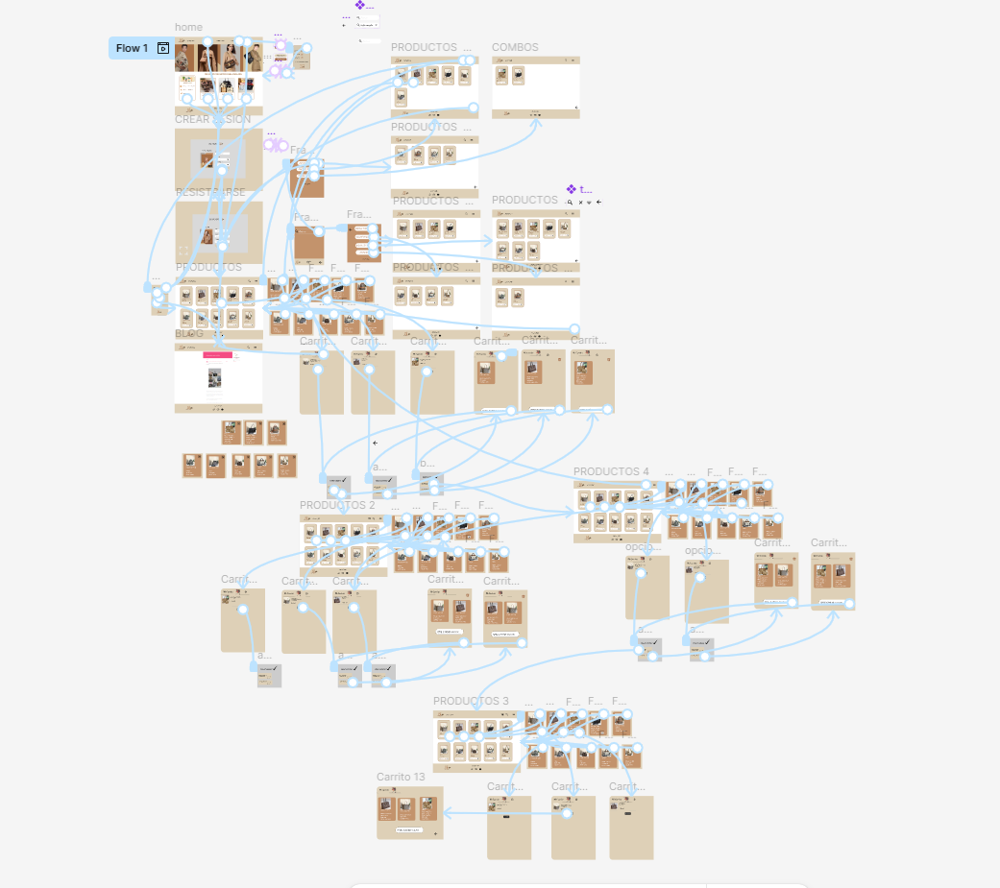
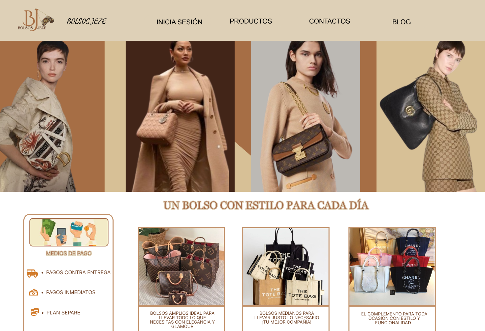
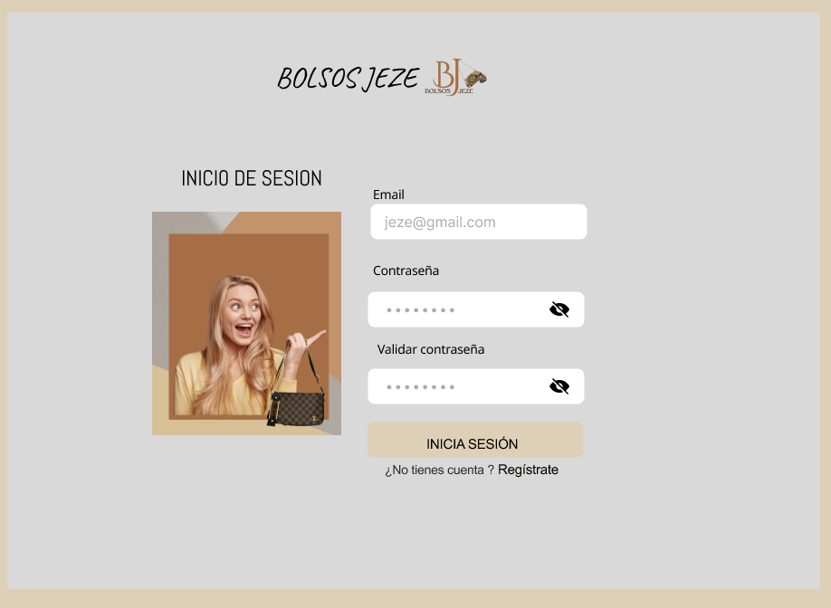
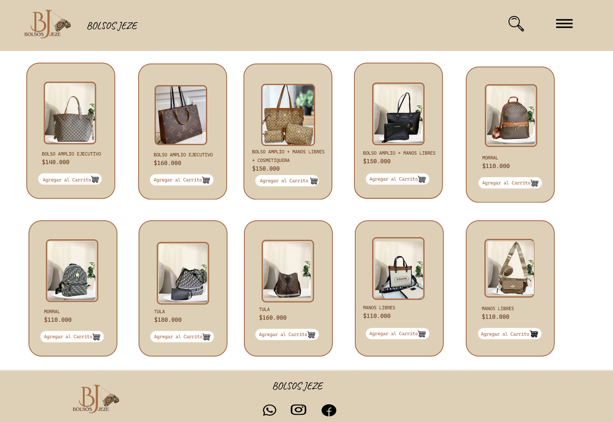
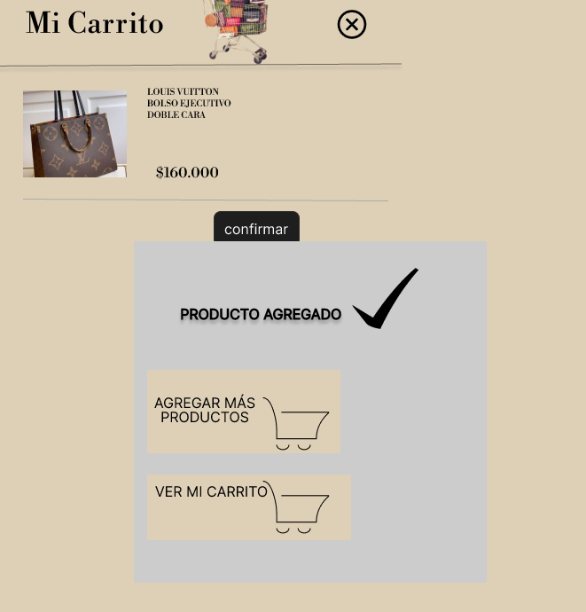
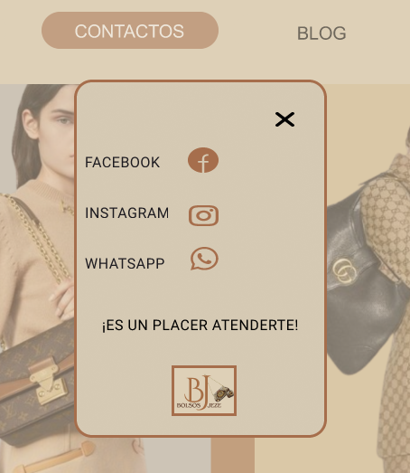
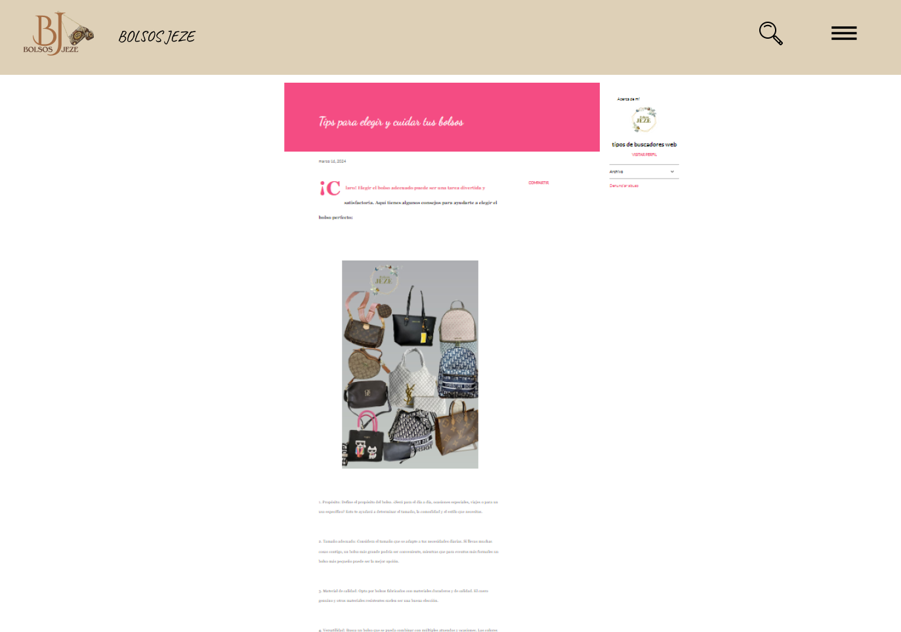

 # Bolsos Jeze – UI/UX E-commerce Design
Proyecto de diseño UI/UX realizado en Figma para una tienda virtual de bolsos y accesorios femeninos.

## Descripción

Bolsos Jeze es un prototipo de e-commerce enfocado en ofrecer una experiencia visual elegante, intuitiva y moderna para usuarios interesados en productos de moda.

El proyecto incluye:
- Diseño de interfaz de usuario (UI)
- Experiencia de usuario (UX)
- Prototipado en Figma
- Flujo de navegación
- Diseño responsive
- Registro e inicio de sesión de usuarios
- Pantallas de productos
- Carrito de compras

## Herramientas utilizadas

- Figma
- UI Design
- UX Design
- Wireframing
- Prototipado
- Responsive Design
- 
## Objetivo del proyecto

Diseñar una experiencia digital atractiva, intuitiva y funcional para una tienda virtual de bolsos, permitiendo a los usuarios explorar productos, registrarse, iniciar sesión y navegar fácilmente dentro de la plataforma.

El prototipo fue desarrollado con el objetivo de mejorar la experiencia de usuario mediante una interfaz moderna, organizada y enfocada en la visualización de productos y flujo de compra.

## Autor

Deissy Esther Esquivia Pérez
---

## Vista general del proyecto

### Flujo UX/UI

### Página de inicio

### Inicio de sesión

### Catálogo de productos

### Carrito de compras

### Contacto

### Blog

